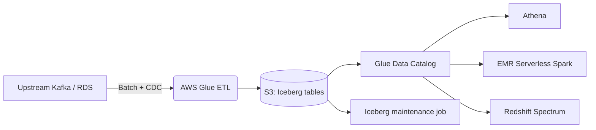

## Why we moved off Hive

Our Hive-on-S3 lake worked, but every week the same tickets showed up: partitions out of sync with S3, `MSCK REPAIR` taking 40 minutes, failed overwrites leaving half-written partitions, and zero schema evolution without a rewrite. We had 4 PB across ~180 tables, roughly 70% parquet, and we wanted ACID, time travel, and hidden partitioning without building it ourselves.

Iceberg on S3 with the Glue Data Catalog as the metastore was the obvious target. What wasn't obvious was the long tail of migration pain.

## Target architecture



## The migration strategy: `add_files`, not rewrite

A full CTAS rewrite of 4 PB was a non-starter — the S3 egress alone was six figures. Iceberg's `add_files` procedure registers existing Parquet files as an Iceberg snapshot without copying data. We used it everywhere we could.

```sql
CALL glue_catalog.system.add_files(
  table => 'analytics.orders',
  source_table => 'hive_db.orders'
);
```

This works only when the Hive table's file layout is clean — one file format, no mixed schemas, partition columns matching. About 60% of our tables qualified. The rest needed a rewrite, which we staged with Glue jobs writing to a shadow Iceberg table, then a cutover.

## What broke

**Small files.** Hive ingestion had produced hundreds of thousands of 2–5 MB files per table. `add_files` preserves that layout, so initial Athena queries were *slower* than Hive. We ran `rewrite_data_files` with a target of 512 MB per file right after migration.

```sql
CALL glue_catalog.system.rewrite_data_files(
  table => 'analytics.orders',
  options => map('target-file-size-bytes', '536870912')
);
```

**Partition evolution traps.** Iceberg's hidden partitioning is great, but if you migrate a Hive table partitioned by `dt=STRING` and keep it as an identity partition, you lose the benefit. We used `ALTER TABLE ... REPLACE PARTITION FIELD` to switch to `days(event_time)` after migration — readers using `WHERE event_time >= ...` got automatic pruning without knowing the partition scheme.

**Concurrent writers.** Glue jobs that used to overwrite with `mode=overwrite` on Hive started failing with `CommitFailedException` once two jobs hit the same table. We moved to MERGE and added retries in the Glue job wrapper.

## Catalog choice: Glue vs REST vs Nessie

We tried all three. Glue Data Catalog won purely for operational reasons — it's already the catalog behind Athena, EMR, and Redshift Spectrum, so every engine just worked. Nessie's branching is genuinely useful but adds a service to run. If you're greenfield and want git-style branching for data, it's worth it. For an existing AWS shop, Glue is the path of least resistance.

## Results after 90 days

- Athena p50 query latency down 38%, p95 down 61% (small-file compaction did most of this).
- Partition maintenance jobs (`MSCK`, manual repair) eliminated entirely.
- Schema evolution PRs went from "rewrite the table overnight" to a one-line `ALTER TABLE`.
- S3 storage up 8% during migration (snapshot retention), back to baseline after expiry policy.

## Key takeaways

1. Use `add_files` wherever the layout is clean. Don't rewrite 4 PB for the sake of purity.
2. Compact immediately after migration or your users will hate Iceberg before it's had a chance.
3. Pick Glue Catalog unless you have a specific reason not to — multi-engine compatibility is the whole game.
4. Budget for snapshot expiry and orphan file cleanup from day one. The [next post on maintenance]() covers the jobs we run on a schedule.
