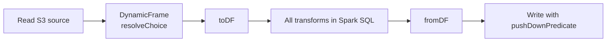

## The 22-minute job that should have taken 3

Our nightly enrichment job read ~180 GB of Parquet, joined against a 40 GB dimension table, and wrote partitioned output to S3. It took 22 minutes on 20 G.1X workers. The spark UI told a familiar story: one stage spent 18 of those minutes on shuffle, with 3 tasks doing 80% of the work.

This post is the playbook we now apply to every Glue job before it hits production.

## Step 1: Pick the right worker type, not the most workers

Glue's pricing is per DPU-hour. A `G.1X` is 1 DPU (4 vCPU, 16 GB). A `G.2X` is 2 DPUs. People reach for more workers when they should reach for bigger workers.

| Worker | vCPU | Memory | Best for |
|--------|------|--------|----------|
| G.1X   | 4    | 16 GB  | Standard ETL, < 1 TB input |
| G.2X   | 8    | 32 GB  | Shuffle-heavy joins |
| G.4X   | 16   | 64 GB  | Large broadcast joins, skew |
| G.8X   | 32   | 128 GB | ML feature engineering |

Rule of thumb: if your executor is spilling to disk (check Spark UI → Executors → Shuffle Spill), go up a worker size before adding workers. Horizontal scaling makes shuffle *worse*, not better.

## Step 2: Fix partition count before anything else

Glue defaults `spark.sql.shuffle.partitions` to 200. For a 180 GB shuffle that's 900 MB per partition — too big. For a 5 GB shuffle it's 25 MB — too small and every task has overhead.

```python
# In the Glue job, set based on estimated shuffle size
target_partition_mb = 128
estimated_shuffle_gb = 180
spark.conf.set(
    "spark.sql.shuffle.partitions",
    max(200, int(estimated_shuffle_gb * 1024 / target_partition_mb))
)
```

Better: enable Adaptive Query Execution and let Spark coalesce for you.

```python
spark.conf.set("spark.sql.adaptive.enabled", "true")
spark.conf.set("spark.sql.adaptive.coalescePartitions.enabled", "true")
spark.conf.set("spark.sql.adaptive.skewJoin.enabled", "true")
```

AQE is on by default in Glue 4.0+ but the skew join handler is not always effective with DynamicFrames. Convert to DataFrame early.

## Step 3: DynamicFrame vs DataFrame

DynamicFrames are useful for the `resolveChoice` and schema handling, but they're slower than DataFrames for everything else. My default is:



Resolve schema ambiguity at the boundary, then stay in DataFrame land.

## Step 4: Job bookmarks — the silent data loss

Bookmarks track processed S3 objects by last-modified time and path. They break in three ways:

1. **Replayed S3 objects**: if upstream overwrites a file, the bookmark skips it on the next run.
2. **Transform changes**: changing the job script does *not* invalidate the bookmark. You'll reprocess nothing.
3. **Partition pruning**: `pushDownPredicate` is applied *after* bookmark filtering, so you can get empty reads that look like "no new data."

We disable bookmarks for anything stateful and use an explicit high-watermark table in DynamoDB instead. Overkill for small jobs, worth it for any pipeline that feeds dashboards or ML.

## Step 5: Write like you mean it

Two changes that consistently help:

```python
df.write \
  .mode("overwrite") \
  .partitionBy("dt", "region") \
  .option("maxRecordsPerFile", 2_000_000) \
  .parquet("s3://lake/curated/orders/")
```

`maxRecordsPerFile` keeps parquet files in the 128–512 MB sweet spot. Without it, one skewed partition produces a 12 GB file that no downstream reader can split efficiently.

For Iceberg output, use `write.distribution-mode = hash` on the table and let Iceberg handle file sizing.

## What 3 minutes looks like

Same job, after the fixes:

- `G.1X` → `G.2X`, workers 20 → 12 (cost down 28%)
- Partitions auto-coalesced by AQE, no manual setting
- DynamicFrame converted to DataFrame after source read
- Skewed join keys salted with a random prefix, 0–9
- Runtime: 3m 14s

## Key takeaways

1. Bigger workers beat more workers for shuffle-heavy jobs.
2. Turn on AQE. Turn on skew join. Convert to DataFrame.
3. Bookmarks are convenient and dangerous. Use explicit watermarks for anything you care about.
4. The Spark UI is the answer. Read it before you tune anything.
