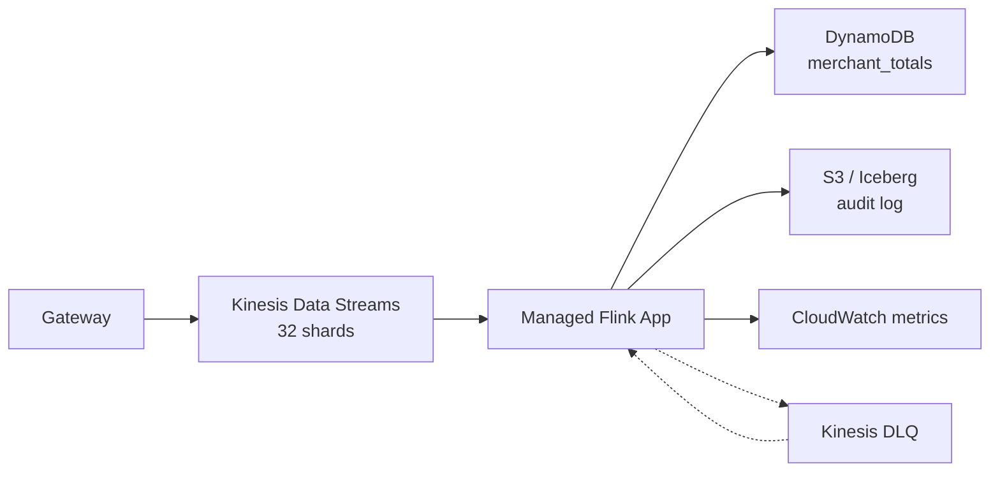

## The problem

A fintech client needed per-merchant transaction totals updated every 10 seconds, with a 1-minute tumbling window and 5-minute watermark tolerance. Volume was ~80k events/sec at peak, spiking to 200k on paydays. Accuracy mattered — these numbers drove fraud rules.

We built it on Kinesis Data Streams → Amazon Managed Service for Apache Flink (MSF, formerly KDA) → DynamoDB for serving, Iceberg for audit.

## Architecture



## Why Flink, not Kinesis Data Analytics SQL or Lambda

We considered three options:

- **Lambda with tumbling windows on Kinesis**: easy, but Lambda windows are per-shard and cap at 15 minutes. No cross-shard aggregation without a second hop.
- **KDA SQL (legacy)**: deprecated. Don't start new projects here.
- **Managed Flink (Java/Python)**: event-time semantics, watermarks, exactly-once to DynamoDB via idempotent writes. Winner.

## The Flink job

The core DataStream API job:

```java
DataStream<Txn> txns = env
    .addSource(new FlinkKinesisConsumer<>(
        "txn-stream", new TxnDeserializer(), kinesisProps))
    .assignTimestampsAndWatermarks(
        WatermarkStrategy.<Txn>forBoundedOutOfOrderness(Duration.ofMinutes(5))
            .withTimestampAssigner((t, ts) -> t.eventTime()));

txns
    .keyBy(Txn::getMerchantId)
    .window(TumblingEventTimeWindows.of(Time.minutes(1)))
    .allowedLateness(Time.minutes(2))
    .sideOutputLateData(lateTag)
    .aggregate(new SumAggregator(), new EnrichWindow())
    .sinkTo(DynamoDbSink.<MerchantTotal>builder()
        .setElementConverter(new MerchantTotalConverter())
        .setTableName("merchant_totals")
        .build());
```

Three details matter here:

1. **Watermark strategy**: 5-minute bounded-out-of-orderness means events more than 5 minutes late get dropped unless you allow lateness. We allow 2 more minutes of lateness, then route the rest to a side output that writes to the Iceberg audit table.
2. **Keyed state, not global state**: keying by `merchantId` distributes work across parallel subtasks. Without this, every event hits one operator.
3. **Idempotent sink**: DynamoDB writes use `merchant_id#window_start` as the partition key, so re-emission on recovery is safe.

## Checkpointing — the setting that decides your sleep quality

MSF checkpoints to S3 by default. The defaults will hurt you.

```java
env.enableCheckpointing(30_000); // 30s
env.getCheckpointConfig().setMinPauseBetweenCheckpoints(10_000);
env.getCheckpointConfig().setCheckpointTimeout(120_000);
env.getCheckpointConfig().setMaxConcurrentCheckpoints(1);
env.getCheckpointConfig().enableUnalignedCheckpoints();
```

**Unaligned checkpoints** are the big one. With backpressure (and you will have backpressure), aligned checkpoints can take minutes. Unaligned lets barriers overtake in-flight records, so checkpoint duration stays bounded. Cost: slightly larger state on recovery. Worth it.

## Capacity: KPUs, not shards

MSF pricing is per KPU (Kinesis Processing Unit = 1 vCPU + 4 GB). At 80k events/sec with our per-event work (~2 ms), we needed ~8 KPUs steady, 16 at peak. We enable auto-scaling with:

- Scale up when CPU > 75% for 3 minutes
- Scale down only when CPU < 30% for 15 minutes (scaling down restarts the job — expensive)

Kinesis shard count is independent. For 80k events/sec at 1 KB each = 80 MB/s ingress. Each shard takes 1 MB/s, so minimum 80 shards. We use 128 with on-demand mode and let it autoscale.

## Late data — where most teams get this wrong

Your watermark says "I promise no events older than 5 minutes will arrive." When a client's clock is off, or a mobile device uploads a week of queued events, that promise breaks. The question is: do you silently drop them, or do you reconcile?

We do both:

- **Hot path**: windowed aggregation in Flink, feeds dashboards and fraud rules. Drops after 7 minutes.
- **Cold path**: the side output writes every late event to Iceberg. A nightly Spark job recomputes daily totals authoritatively and reconciles DynamoDB.

Dashboards are fast and wrong by < 0.1%. Audit is slow and right. Both coexist.

## Key takeaways

1. Use Managed Flink unless your use case is genuinely one-shard-per-key and fits in a Lambda window.
2. Set watermarks based on your worst-case client, not your average. Then route late data, don't drop it.
3. Enable unaligned checkpointing. Thank me during your first backpressure incident.
4. Separate hot and cold paths. Speed and correctness have different SLAs.
