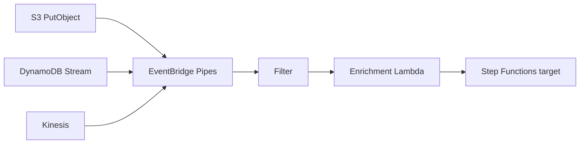

## "Just use Lambda" is not an architecture

Lambda is wonderful until it isn't. I've seen teams build entire lakehouses on S3 events → Lambda and then wonder why their bill is higher than EMR, their retries are non-idempotent, and their DLQ has 400k messages no one looks at.

This post is about the patterns that work, the ones that don't, and how to reason about the boundary.

## Three patterns I keep using

### 1. Fan-in with EventBridge Pipes

When you have many sources (S3, DynamoDB streams, Kinesis, Kafka) and one destination workflow, Pipes is the cleanest glue I've found.



The filter stage runs in the event broker, not in your code — so you don't pay Lambda invocations for events you'd immediately drop. That single property saves serious money when your trigger is chatty.

### 2. Thin dispatcher, thick worker

Never put your ETL logic directly on an S3 trigger. The pattern:

```python
def lambda_handler(event, context):
    for record in event["Records"]:
        key = record["s3"]["object"]["key"]
        if not should_process(key):
            continue
        sfn.start_execution(
            stateMachineArn=STATE_MACHINE,
            name=f"job-{hashlib.sha1(key.encode()).hexdigest()[:12]}",
            input=json.dumps({"bucket": bucket, "key": key})
        )
```

The Lambda is a router. The Step Function does the work — it can call Glue, ECS, Batch, whatever. Idempotency comes from the deterministic execution name (duplicate S3 events with the same key get deduplicated by Step Functions' `ExecutionAlreadyExists` error).

### 3. Micro-batching with SQS

S3 → SQS → Lambda with batch size 10 and `MaximumBatchingWindow = 30s`. This one change converts per-file invocations into per-batch, cutting Lambda cost by 10× when files are small.

```yaml
Events:
  S3Event:
    Type: SQS
    Properties:
      Queue: !GetAtt IngestQueue.Arn
      BatchSize: 10
      MaximumBatchingWindowInSeconds: 30
      FunctionResponseTypes: [ReportBatchItemFailures]
```

Critical: report partial batch failures (`ReportBatchItemFailures`). Without it, one poison message fails the whole batch and retries everything — and you'll rediscover why your S3 job is running 8×.

## What Lambda is bad at

- **Long-running work (> 15 min)**: use Batch or ECS.
- **Heavy memory + short work**: Fargate Spot is cheaper above ~4 GB.
- **Dependency-heavy Python**: cold starts with pandas + pyarrow push 3–5 seconds. Use container images and provisioned concurrency, or switch to Glue Python Shell.
- **Cross-region writes**: latency compounds. Put the Lambda in the same region as the destination.

## The cost trap

Lambda per-GB-second is cheap until you realize you're running 50M invocations/day at 512 MB for 4 seconds. That's roughly $430/month just for compute, before request cost. An ECS Fargate service at 1 vCPU / 2 GB that polls the same queue costs ~$30/month.

The break-even is roughly: if your function is busy more than 20% of the time across a steady stream, container-based is cheaper.

## Idempotency is not optional

EventBridge and SQS are at-least-once. Your Lambda will be invoked twice for the same event. Patterns that work:

1. **Deterministic output keys**: S3 writes to `s3://bucket/derived/{sha1(input_key)}.parquet`. A second invocation overwrites the same key; no duplicates downstream.
2. **Conditional DynamoDB writes**: `ConditionExpression: "attribute_not_exists(event_id)"` on an idempotency table with a TTL.
3. **Step Functions execution names**: as above, a hash of the input event.

Do not rely on "it's probably fine" — it won't be, and you'll find out from a finance dashboard.

## Key takeaways

1. Lambda is glue, not a compute fabric. Keep it thin.
2. EventBridge Pipes filters are free money — use them.
3. SQS batching + partial batch failures is the default, not an optimization.
4. Idempotency is a first-class requirement. Design for it on day one.
