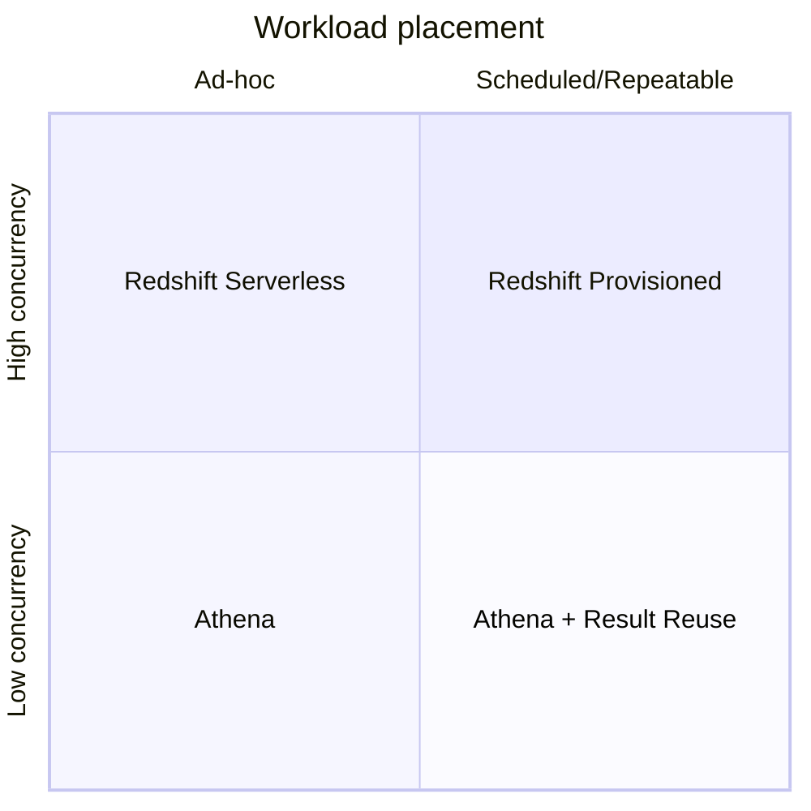
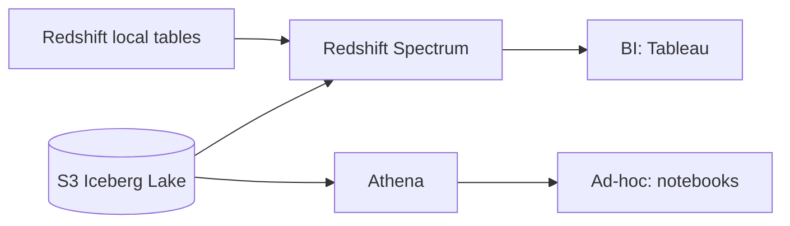

## The wrong question

"Should we use Redshift or Athena?" is the question I get most often, and it's nearly always the wrong one. The right question is: for *this specific workload*, which engine has lower total cost at acceptable latency?

"This specific workload" matters because a platform with 30 dashboards and 200 analysts has both workloads — some jobs belong on Redshift, some on Athena, and forcing one answer is how you get a $90k/month Redshift cluster serving 4 heavy users.

## The four axes

We evaluate every workload on four axes:



- **Concurrency**: how many queries at once, and what's the p95 arrival burst?
- **Repeatability**: same query shape on the same data every day, or exploratory?
- **Latency SLO**: is 15 seconds acceptable, or do you need 800 ms?
- **Data gravity**: is the data already landed in S3 (Iceberg/Parquet), or does it live in Redshift-native tables?

## When Athena wins

- **Ad-hoc analytics over S3 data**. You pay per TB scanned; nothing to keep warm. Column pruning + partition filters matter enormously here — unpartitioned tables will bankrupt you fast.
- **Low-concurrency BI** (< 20 concurrent queries). Athena's workgroups handle this cleanly with per-query data limits and cost controls.
- **Occasional heavy scans**. A quarterly audit that scans 8 TB once is ~$40 on Athena and $0 capacity planning. On Redshift you pay for capacity you don't use the other 89 days.

Two features that change the math in 2025:

- **Iceberg read performance**: Athena with Iceberg is substantially faster than Athena over raw Parquet because of manifest-level pruning.
- **Result reuse**: identical queries in a workgroup return cached results free for up to 7 days. Dashboards with shared panels pay once.

## When Redshift wins

- **Sub-second BI dashboards**. Materialized views, sort keys, and the query cache make Redshift hard to beat for the "1000 analysts hitting the same Tableau workbook" pattern.
- **Workloads with complex joins and SLAs**. Redshift's cost-based optimizer and distribution keys matter when you're joining 4+ large tables repeatedly.
- **ELT with complex SQL pipelines**. dbt on Redshift is a mature, productive stack. Athena can do it but you'll feel the absence of a real planner on complex models.

Redshift Serverless changes the calculus for bursty workloads — you pay per RPU-hour with a minimum, and it scales automatically. My rough rule: if utilization exceeds ~35% sustained, provisioned is cheaper; below, Serverless wins.

## The hybrid pattern we actually run



- Hot, frequently-joined fact tables live as Redshift-local tables.
- Cold history, audit, raw events live in Iceberg on S3.
- Redshift Spectrum joins them transparently.
- Analysts go through Redshift for dashboards, Athena for exploration.

Spectrum scan cost is the same $5/TB as Athena; the cost difference is the cluster. By keeping Redshift small and offloading history to S3, we cut cluster size by 60% with no user-visible latency change.

## Example: same query, two engines

```sql
SELECT merchant_id, SUM(amount) AS gmv
FROM orders
WHERE dt BETWEEN '2025-05-01' AND '2025-05-31'
GROUP BY merchant_id
ORDER BY gmv DESC
LIMIT 100;
```

Over 180 GB of partitioned Iceberg data:

| Engine | Latency (p50) | Cost per run |
|--------|---------------|--------------|
| Athena (Iceberg) | 12s | ~$0.90 |
| Redshift Serverless (8 base RPU) | 3s | ~$0.28 in-burst |
| Redshift Provisioned (ra3.4xlarge × 4) | 1.4s | amortized ~$0.05 if run 500×/day |

The "right" answer depends entirely on how often this runs. Once a week: Athena. 500 times a day: Redshift.

## Decision checklist

Before placing any workload, I answer these:

1. How many times per day will this exact shape of query run?
2. What's the user-facing latency target?
3. How many concurrent users?
4. Is the source already in S3 as Iceberg/Parquet?
5. What's the budget ceiling — in dollars, not RPUs?

If it runs < 50×/day and tolerates 10s: Athena. If it runs thousands of times and needs < 2s: Redshift. If in between: Redshift Serverless with a cost alarm.

## Key takeaways

1. There is no single right engine. There are workloads, and each has a right engine.
2. Iceberg on S3 + Spectrum means Redshift doesn't have to own all your data.
3. Result reuse and materialized views are the two features that most change the cost equation.
4. Always set workgroup cost caps. Always.
