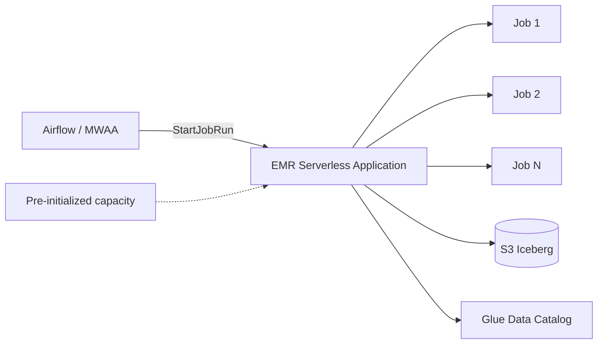

## The problem with long-running EMR clusters

Our data platform ran ~320 Spark jobs across three EMR-on-EC2 clusters: a big persistent cluster for ad-hoc, two transient clusters for nightly ETL. Utilization averaged 34%. Peak was 88%. We were paying for 66% idle capacity every day.

Moving those 320 jobs to EMR Serverless took about six weeks. Here's the actual breakdown of what worked, what broke, and where EMR Serverless is *not* the right answer.

## The cost model, in plain language

EMR on EC2 charges for the cluster the whole time it's up — whether anyone's running a job or not. EMR Serverless charges for vCPU-seconds + GB-seconds *of actual execution*, billed per second after a 1-minute minimum.

That billing shape means:

- **Sparse, bursty workloads** win big. A job that runs 5 minutes every hour on a dedicated cluster pays 24× more.
- **Steady, 24/7 jobs** actually cost slightly *more* on Serverless — the per-second rate is a premium over Reserved EC2.
- **Mixed workloads** almost always win if you right-size per job.

## Architecture: one application, many jobs



A Serverless "application" is a billing boundary and a warm pool, not a cluster. You create one per workload class (say, one for ad-hoc, one for nightly ETL, one for streaming-ish micro-batches) and submit jobs to it.

## The setting that makes this work: pre-initialized capacity

The dirty secret: cold starts on EMR Serverless can be 60–120 seconds. For a 3-minute job, that doubles runtime and cost.

```json
{
  "initialCapacity": {
    "Driver": {
      "workerCount": 1,
      "workerConfiguration": { "cpu": "4vCPU", "memory": "16GB" }
    },
    "Executor": {
      "workerCount": 8,
      "workerConfiguration": { "cpu": "4vCPU", "memory": "16GB" }
    }
  },
  "maximumCapacity": { "cpu": "200vCPU", "memory": "800GB" },
  "autoStopConfiguration": { "idleTimeoutMinutes": 15 }
}
```

Pre-initialized workers are kept warm. You pay for them whether a job uses them or not, so don't go crazy — we keep just enough warm capacity to cover p50 concurrent jobs. Bursts spin up fresh workers.

## Job submission that doesn't suck

The default `spark-submit` invocation from `StartJobRun` is verbose. We wrap it:

```python
def submit(app_id, script, conf=None, jars=None):
    spark_submit = [
        "--conf", "spark.sql.extensions=org.apache.iceberg.spark.extensions.IcebergSparkSessionExtensions",
        "--conf", "spark.sql.catalog.glue=org.apache.iceberg.spark.SparkCatalog",
        "--conf", "spark.sql.catalog.glue.catalog-impl=org.apache.iceberg.aws.glue.GlueCatalog",
        "--conf", "spark.sql.catalog.glue.warehouse=s3://lake/warehouse/",
        "--conf", "spark.dynamicAllocation.enabled=true",
    ]
    if jars:
        spark_submit += ["--jars", ",".join(jars)]
    for k, v in (conf or {}).items():
        spark_submit += ["--conf", f"{k}={v}"]

    return emr.start_job_run(
        applicationId=app_id,
        executionRoleArn=ROLE,
        jobDriver={"sparkSubmit": {
            "entryPoint": script,
            "sparkSubmitParameters": " ".join(spark_submit)
        }},
        configurationOverrides={
            "monitoringConfiguration": {
                "s3MonitoringConfiguration": {"logUri": "s3://logs/emrs/"}
            }
        },
    )
```

## What broke

**Shuffle-heavy jobs**. EMR Serverless uses local NVMe for shuffle, but there's less of it per worker than you'd get on an r6gd EC2 instance. A few jobs with 800 GB shuffle started failing with `DiskFull`. Fix: bump worker disk with `spark.emr-serverless.driver.disk` / `.executor.disk` to 200 GB.

**Custom JARs**. Our EC2 cluster had bootstrap actions installing custom UDFs. On Serverless, you package them and point `--jars` at S3. Straightforward, but every team had to migrate their own.

**Port to Spark 3.4+**. Serverless supports recent Spark versions, but our jobs were pinned to 3.1. We hit a few `SparkSession.builder` incompatibilities. One afternoon of fixes; not a blocker.

## The numbers

Before/after across 320 jobs over 30 days:

| Metric | EMR on EC2 | EMR Serverless | Δ |
|--------|-----------|----------------|---|
| Total spend | $47,200 | $21,100 | −55% |
| Avg job queue time | 4m 12s | 0m 38s | −85% |
| p95 job runtime | 18m | 19m | +5% |
| Operational overhead | 1 FTE | ~0.1 FTE | significant |

p95 runtime went up slightly (5%) from occasional cold starts. We decided that's a fair trade for more than halving the bill.

## When EMR Serverless is the wrong choice

- **Streaming Spark**. Structured Streaming works but isn't the natural fit; use Managed Flink or Glue Streaming.
- **Jobs that need specific EC2 instance types**: GPU jobs, high-memory genomics, etc. Use EMR on EKS instead.
- **Jobs that run 24/7 at high utilization**. EC2 Reserved is cheaper.

## Key takeaways

1. EMR Serverless shines for sparse, bursty, mixed workloads — which is most analytics platforms.
2. Pre-initialized capacity is non-negotiable for sub-5-minute jobs.
3. Watch shuffle disk on big jobs. The default isn't generous.
4. Migrate by workload class, not all-at-once. Move ad-hoc first, steady ETL last.
