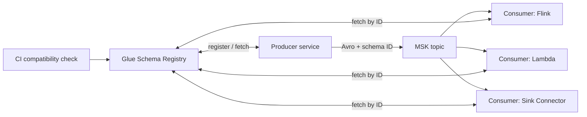
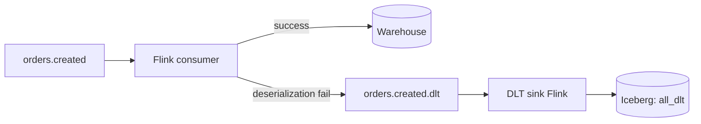

## The 3 AM incident

A service team deployed a change that renamed a field from `user_id` to `userId`. Our consumers — 14 of them — started throwing deserialization errors. One team's Flink job failed open and wrote nulls to the warehouse for 40 minutes before pagers woke us. The post-mortem had a one-line root cause: no contract enforcement on the topic.

This post is the platform we built so that incident can't happen again.

## The rules

We enforce three rules on every production topic:

1. **Every topic has a schema** registered in AWS Glue Schema Registry.
2. **Every producer** serializes with the registered schema and the Glue SerDe.
3. **Every schema change** goes through a CI check that validates compatibility.

No exceptions. Not for "temporary" topics, not for internal ones. Every one.

## Architecture



The wire format is the standard 5-byte prefix: magic byte + 4-byte schema ID, then Avro binary. Consumers look up the schema by ID on first encounter and cache it.

## Registering schemas from CI

Schemas live in a `schemas/` directory in a central repo, one file per subject. A merge to `main` runs:

```bash
aws glue register-schema-version \
  --schema-id SchemaName=orders.created \
  --schema-definition file://schemas/orders.created.avsc \
  --compatibility BACKWARD
```

`BACKWARD` means new consumers can read old data. Most of our topics use this; a few use `FULL` (both directions) because we have long-lived replays.

The CI check that prevented the incident:

```bash
aws glue check-schema-version-validity \
  --data-format AVRO \
  --schema-definition file://schemas/orders.created.avsc

aws glue get-schema-version --schema-id SchemaName=orders.created \
  --schema-version-number LatestVersion=true \
  > /tmp/current.json

# Fails the build if the new schema isn't backward-compatible
python -m schema_tools.compat_check \
  --current /tmp/current.json \
  --new schemas/orders.created.avsc \
  --mode BACKWARD
```

## Producer pattern

```python
from aws_schema_registry import SchemaRegistryClient, DataAndSchema
from aws_schema_registry.avro import AvroSchema
from kafka import KafkaProducer

registry = SchemaRegistryClient(
    glue_client=boto3.client("glue"),
    registry_name="events"
)
serializer = KafkaSerializer(registry)

schema = AvroSchema(open("orders.created.avsc").read())

producer = KafkaProducer(
    bootstrap_servers=MSK_BOOTSTRAP,
    value_serializer=serializer,
    security_protocol="SASL_SSL",
    sasl_mechanism="AWS_MSK_IAM",
)

producer.send("orders.created", DataAndSchema(event_dict, schema))
```

The IAM auth (`AWS_MSK_IAM`) means no password rotation, no SASL/SCRAM secrets. Producer role grants `kafka-cluster:WriteData` on the topic resource and `glue:GetSchemaVersion` on the registry.

## Dead letter topics, not DLQs

Traditional DLQs dump failures to SQS. We don't — consumer failures from schema incompatibility go to a *sibling topic* with the suffix `.dlt`, preserving ordering and replay semantics. A small Flink job reads from all `.dlt` topics and writes to Iceberg for analysis.



When the 3 AM incident would have happened, our dashboard shows the `.dlt` rate spiking within 30 seconds and the on-call knows exactly which topic and schema version.

## MSK sizing: the three numbers

Right-sizing MSK comes down to:

- **Ingress MB/s** — size brokers by network limits. `kafka.m7g.large` handles ~120 MB/s sustained.
- **Partition count per broker** — keep under 1000 per broker including replication. Over that, controller ops get slow.
- **Retention × ingress** — disk sizing. 7 days × 100 MB/s × 3 replicas = ~180 TB. Use tiered storage (MSK Serverless does this automatically).

We moved to MSK Serverless for topics with unpredictable traffic and kept provisioned for the steady-state high-throughput ones. Mixed-mode MSK isn't a thing; these are separate clusters with MirrorMaker2 bridging where needed.

## Key takeaways

1. Schemas on day one, not after the first incident. Retro-fitting contracts is 10× the work.
2. CI compatibility checks are cheap. Ship them before anyone writes a producer.
3. Dead-letter *topics*, not queues — keeps ordering and makes replay trivial.
4. IAM auth eliminates a whole class of credential problems. Use it.
