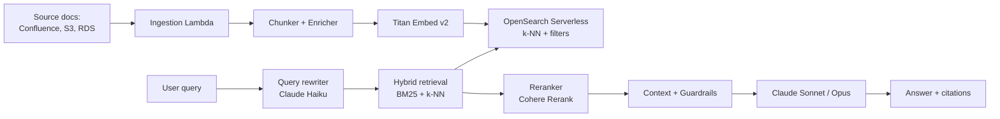

## The demo-to-production gap

The first RAG demo took an afternoon — Knowledge Bases for Bedrock, point at an S3 bucket, done. The production system took four months. Everything that separates "impressive demo" from "answering customer support tickets reliably" lives in that gap.

This post is the stack we landed on and the tuning knobs that actually moved quality.

## Reference architecture



Six distinct stages, each tunable, each measured.

## Chunking — the 80/20 lever

Default chunking (fixed 512 tokens, 50 overlap) is a generic sledgehammer. Real improvements came from making chunking aware of the document structure:

- **Markdown/HTML docs**: chunk on headings, keep H1/H2 path as metadata on every chunk.
- **Code + prose docs**: chunk code blocks intact, never split.
- **Tabular data**: don't chunk at all. Serialize rows with column context as separate chunks.

```python
def chunk_markdown(doc: str) -> list[Chunk]:
    sections = split_by_heading(doc, max_level=3)
    out = []
    for sec in sections:
        for body in split_text(sec.body, max_tokens=600, overlap=80):
            out.append(Chunk(
                text=body,
                metadata={
                    "heading_path": sec.path,      # ["Installation", "macOS"]
                    "source": sec.source,
                    "doc_type": sec.doc_type,
                    "updated_at": sec.updated_at,
                },
            ))
    return out
```

The metadata is what makes filtered retrieval work — "answer only from the last 90 days of runbooks" becomes a query-time filter, not a re-index.

## Hybrid retrieval beats pure vector, consistently

We A/B'd pure k-NN vs BM25 vs hybrid over a 300-question eval set.

| Retrieval | Recall@10 |
|-----------|-----------|
| k-NN only | 0.71 |
| BM25 only | 0.68 |
| Hybrid (0.5/0.5) | 0.82 |
| Hybrid + rerank top-50 | 0.91 |

Vector search is great for semantic similarity but terrible for proper nouns, error codes, and acronyms. BM25 is the opposite. Combine them.

OpenSearch Serverless supports hybrid queries natively:

```json
{
  "query": {
    "hybrid": {
      "queries": [
        { "match": { "text": "dynamodb throttling symptoms" } },
        { "knn": { "embedding": { "vector": [...], "k": 50 } } }
      ]
    }
  },
  "size": 50
}
```

## Reranking is cheap and underrated

A Cohere Rerank call on the top 50 hybrid results to pick the top 8 adds ~200 ms and costs fractions of a cent per query. In our evals it lifted answer correctness by 12 points. This is the single highest-ROI change we made after hybrid retrieval.

## The guardrails you actually need

Bedrock Guardrails handles the obvious (PII, toxicity, jailbreak patterns). Those are table stakes. The less obvious but higher-value guardrails:

- **Source-attribution enforcement**. The answer must cite chunk IDs. If it doesn't, reject and retry with a stricter prompt.
- **Out-of-domain detection**. A classifier (cheap Haiku call) decides whether the question is in your knowledge domain. Off-topic queries get a polite decline, not a hallucinated answer.
- **Freshness check**. If the top-ranked chunks are > N days old for a time-sensitive query, caveat the answer.

## Evaluation is the project, not a subtask

Without a continuous eval harness you cannot tell whether a change helped. Ours runs nightly:

- 500 labeled Q/A pairs, updated weekly from real support tickets.
- Metrics: answer correctness (LLM-judged), faithfulness to retrieved context, citation accuracy, latency p95, cost per query.
- Every change to chunking, retrieval, prompts, or models triggers a comparison report.

```python
for q in eval_set:
    ctx = retrieve(q.question, k=8)
    ans = generate(q.question, ctx)
    score = judge(q, ans, ctx)   # another LLM, Claude Haiku
    log_row(q, ans, ctx, score)
```

Treat retrieval-augmented generation as a machine learning system, not a feature. You need a test set and a loop.

## Cost realism

Per query, in production:

- Embedding (only on ingestion): negligible
- Retrieval (OpenSearch Serverless): ~$0.0004
- Rerank (top-50): ~$0.001
- Generation (Claude Sonnet, ~2k context, 300 output): ~$0.012
- **Total: ~$0.014 per answer**

Cache aggressively. Bedrock prompt caching on the system prompt + instructions cut generation cost ~35% with no quality hit. For repeat queries, cache the full answer.

## Key takeaways

1. Chunking with structure-aware boundaries and rich metadata is the highest-leverage change.
2. Hybrid retrieval + rerank is the default production stack. Pure vector is a demo pattern.
3. Guardrails beyond PII: attribution, out-of-domain, freshness. These stop the worst failures.
4. Build the eval harness before you tune anything. Without it you're decorating.
