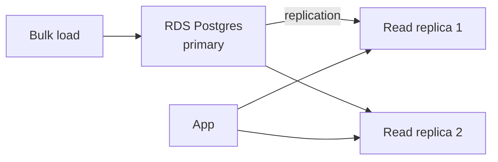

## Three workloads, three databases

In the last year I've put semantic search into three very different products. The "right" vector database was different every time. Here's how we chose, what broke, and when I'd change my mind.

## The workloads

**A. Internal knowledge search** — 1.2M chunks, ~10 queries/sec, metadata filtering, cost-sensitive.

**B. Customer-facing product search** — 40M items, 800 queries/sec at peak, strict p99 < 80ms, hybrid retrieval.

**C. Agent memory for a multi-tenant app** — 200 tenants, 5k–500k vectors each, per-tenant isolation, low write volume.

## The short answer

| Workload | Pick | Why |
|----------|------|-----|
| A: internal KB | pgvector on existing Postgres | Reuse the database you already operate |
| B: high-QPS product search | OpenSearch Serverless | Hybrid BM25 + k-NN, scales horizontally |
| C: multi-tenant agent memory | Pinecone (namespaces) | Per-namespace isolation, zero ops |

The long answer is the rest of this post.

## pgvector

Where it shines:

- You already run Postgres. No new system. Backups, monitoring, IAM — all the boring stuff is solved.
- Transactional consistency between vectors and business data. A single `SELECT` can filter by tenant, status, date *and* rank by cosine distance.
- HNSW index (since pgvector 0.5) performs well up to a few million vectors per table.

Where it hurts:



- **Index build time**: HNSW index on 10M rows with 1024-dim vectors took 4+ hours on `db.r6i.4xlarge`. Plan for it.
- **Memory pressure**: HNSW is in-memory to be fast. Budget 1.5–2× your vector footprint in RAM.
- **Hybrid search** is DIY. You write your own BM25 (or use `pg_trgm`) and combine scores in SQL. It works, but it's bespoke.

Ran pgvector for workload A at ~$400/month on an existing RDS cluster. Query p95 was 45 ms. Zero new ops cost.

## OpenSearch Serverless

Where it shines:

- **Hybrid queries are native**. Combining BM25 and k-NN is one JSON body. This is huge for product search.
- **Scales out** to billions of vectors without re-architecting.
- **Rich filtering** at query time using the full Lucene query DSL.

Where it hurts:

- **OCU-based pricing** has a floor. Under ~$600/month it's not cost-effective; "serverless" here doesn't mean "zero when idle."
- **Write latency** from bulk indexing can spike compaction. For ingestion-heavy workloads, size write OCUs separately.
- **Consistency model** is eventual. A freshly indexed doc may not be searchable for ~1s. For RAG this is fine; for "show the user the thing they just uploaded" it's a UX gotcha.

Workload B on OpenSearch Serverless, collection size ~60 GB, hybrid retrieval p99 at 62 ms. Monthly cost around $2,400. Worth every cent for the 800 QPS.

## Pinecone

Where it shines:

- **Namespaces** are first-class. Per-tenant isolation with no cross-tenant bleed, and deleting a tenant is one API call.
- **Serverless tier** scales to zero for cold tenants.
- **Operational simplicity** is unmatched. There is nothing to tune.

Where it hurts:

- **Filters** are less expressive than OpenSearch. Composite filters over many metadata fields get slow.
- **Cost** becomes painful at scale if your access patterns don't fit the serverless model.
- **Egress** out of AWS → Pinecone is a consideration for sensitive workloads.

Workload C uses Pinecone serverless across 200 namespaces. The largest namespace has 500k vectors, the smallest 5k. Total cost ~$350/month, with effectively zero operational load.

## The benchmark that matters

Not recall@10 on a public dataset. Measure *your* workload:

1. Your vectors, your dimensionality, your quantity.
2. Your query shape, including filters and ranges.
3. Your write rate.
4. Your p99 target.

I run this little harness on every candidate:

```python
def bench(client, queries, k=10):
    warm = [client.search(q, k=k) for q in queries[:100]]
    t = []
    for q in queries:
        s = time.perf_counter()
        client.search(q, k=k)
        t.append(time.perf_counter() - s)
    return {"p50": p(t, 50), "p95": p(t, 95), "p99": p(t, 99)}
```

Run it at target QPS. Publish the numbers to your team. Decide with data.

## What I'd change my mind about

- **pgvector for workload B**? No. Horizontal scaling is too painful.
- **OpenSearch for workload A**? Possibly, if we outgrow Postgres. Not yet.
- **Pinecone for workload B**? No. Hybrid retrieval still lives better on OpenSearch.

## Key takeaways

1. The "best" vector DB is the one that matches your workload, not the one on the leaderboard.
2. Hybrid retrieval makes or breaks product search. If you need it, OpenSearch is hard to beat on AWS.
3. pgvector is dramatically underrated for sub-10M-vector workloads on existing Postgres.
4. Pinecone's namespaces are the easiest multi-tenant story of the three.
