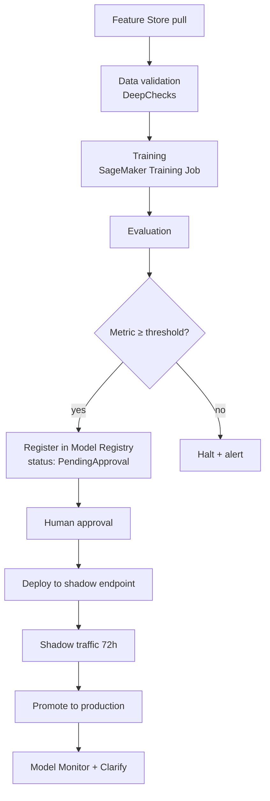

## The handoff problem

Data scientists ship notebooks. Production wants reproducibility, audit, and monitoring. SageMaker Pipelines is the glue that made this handoff boring at our org — and boring is the highest compliment you can pay a platform.

## The pipeline we run



Six named stages, one halt gate, one manual approval. Each stage is a step in the pipeline definition.

## Pipeline as code, not as clicks

```python
from sagemaker.workflow.pipeline import Pipeline
from sagemaker.workflow.steps import ProcessingStep, TrainingStep
from sagemaker.workflow.condition_step import ConditionStep
from sagemaker.workflow.conditions import ConditionGreaterThanOrEqualTo

validation = ProcessingStep(
    name="ValidateFeatures",
    processor=sklearn_processor,
    code="src/validate.py",
    outputs=[ProcessingOutput(output_name="report", source="/opt/ml/processing/report")],
)

train = TrainingStep(
    name="TrainModel",
    estimator=xgb,
    inputs={"train": TrainingInput(s3_data=features_s3, content_type="parquet")},
)

evaluate = ProcessingStep(
    name="EvaluateModel",
    processor=sklearn_processor,
    code="src/evaluate.py",
    inputs=[ProcessingInput(
        source=train.properties.ModelArtifacts.S3ModelArtifacts,
        destination="/opt/ml/processing/model",
    )],
)

min_auc = ConditionGreaterThanOrEqualTo(
    left=JsonGet(step_name=evaluate.name, property_file=eval_report, json_path="metrics.auc"),
    right=0.82,
)

gate = ConditionStep(
    name="QualityGate",
    conditions=[min_auc],
    if_steps=[register],
    else_steps=[fail],
)

Pipeline(
    name="churn-v3",
    parameters=[threshold, training_instance, data_version],
    steps=[validation, train, evaluate, gate],
).upsert(role_arn=ROLE)
```

The pipeline definition lives in git. Every execution is reproducible from a commit SHA + a data version parameter. When a model misbehaves in prod, we can re-run the exact pipeline that produced it.

## Feature Store: online and offline in one place

SageMaker Feature Store splits each feature group into:

- **Online store** (DynamoDB-backed) for inference latency
- **Offline store** (S3 + Glue table) for training and backfill

The magic: the schema is shared, and the offline store is queryable from Athena. Training reads from Athena, inference reads from DynamoDB, and they're provably the same features.

```python
fg.put_record(record=[
    {"FeatureName": "customer_id", "ValueAsString": str(cid)},
    {"FeatureName": "lifetime_value", "ValueAsString": f"{ltv:.4f}"},
    {"FeatureName": "event_time", "ValueAsString": now_iso},
])
```

Backfill from a Spark job writes to both stores via the ingestion API. Training-serving skew — a whole class of bugs — largely disappears.

## Model Registry as the source of truth

Every model from every pipeline run is registered with:

- The pipeline execution ARN (traceability back to code + data)
- The training dataset version
- Evaluation metrics as model metadata
- Approval status (`PendingApproval`, `Approved`, `Rejected`)

Deploy scripts only deploy `Approved` models. This single rule prevents "which model is running in prod?" from ever being a question again.

## Monitoring — the part most teams skip

SageMaker Model Monitor watches four things:

1. **Data quality** — schema, nulls, ranges of incoming features drifting from training baseline
2. **Model quality** — delayed ground truth joined back, comparing predictions to actuals
3. **Bias drift** — Clarify metrics for protected attributes
4. **Feature attribution drift** — SHAP value distributions shifting over time

We wire each to CloudWatch alarms. Data drift alerts route to the data engineering on-call; model drift alerts route to the data science team. Different rotations, different action playbooks.

## Shadow deployment is cheap insurance

Before promoting to the real endpoint, new model versions run as shadow variants receiving 100% of traffic (production still serves from the current variant). Predictions from both are logged side-by-side for 72 hours.

```python
endpoint_config = sm.create_endpoint_config(
    EndpointConfigName="churn-shadow-v3",
    ProductionVariants=[{
        "VariantName": "prod",
        "ModelName": "churn-v2",
        "InitialInstanceCount": 4,
        "InstanceType": "ml.m5.xlarge",
    }],
    ShadowProductionVariants=[{
        "VariantName": "shadow",
        "ModelName": "churn-v3",
        "InitialInstanceCount": 2,
        "InstanceType": "ml.m5.xlarge",
    }],
)
```

72 hours of real traffic, no user impact, full comparison report. Twice this caught latency regressions we'd never have seen in offline tests.

## Key takeaways

1. Pipeline-as-code with a quality gate and model registry is the minimum viable MLOps stack.
2. Feature Store eliminates training/serving skew when used consistently — partial adoption buys nothing.
3. Model Monitor is required, not optional. Drift is inevitable; undetected drift is the problem.
4. Shadow deployments catch latency and correctness issues that offline eval misses. They're cheap. Use them.
