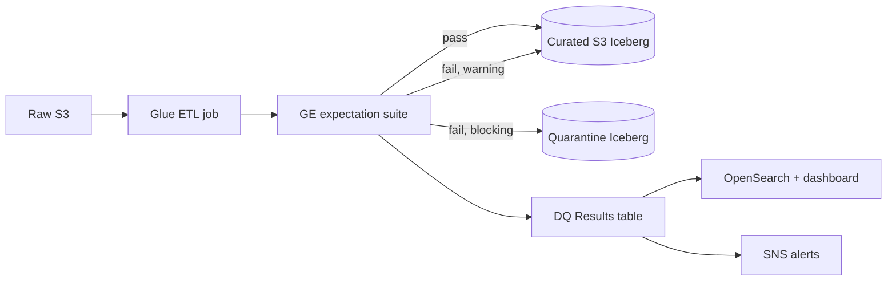

## The job of a DQ framework

Not "catch every bad row." That's impossible and expensive. The real job of a data quality framework is to **make bad data visible, quarantined, and attributable** — fast enough that downstream doesn't silently consume it.

We use Great Expectations on AWS Glue. Here's what that looks like in practice after running it on ~200 tables for a year.

## The architecture



Two output paths after validation, plus a row-level results table. Every failed expectation gets a row in DQ results with the offending values.

## The four classes of expectation

After a year, our suites broke down roughly like this:

1. **Structural** — schema, types, nullability. Written by the platform, not per-table.
2. **Business rules** — ranges, referential integrity, domain-specific invariants. Per-table, written by data owners.
3. **Volumetric** — row counts within 3σ of 14-day rolling average, null rate stability. Generated automatically.
4. **Freshness** — latest partition exists, max event_time is within N minutes of wall clock.

We stopped writing per-column statistical expectations (distribution checks, quantile checks). They generate too many false positives on real data.

## Blocking vs warning

Not every failure should halt a pipeline. We classify expectations two ways:

- **Blocking**: primary key uniqueness, foreign key resolution, not-null on required fields, schema match. Failure → quarantine partition, halt downstream, page on-call.
- **Warning**: statistical drift, distribution shifts, optional column nulls. Failure → log, alert Slack, continue writing.

```python
suite = ge.get_expectation_suite("orders_suite")

suite.add_expectation(ExpectationConfiguration(
    expectation_type="expect_column_values_to_not_be_null",
    kwargs={"column": "order_id"},
    meta={"severity": "blocking", "owner": "orders-team"},
))

suite.add_expectation(ExpectationConfiguration(
    expectation_type="expect_column_mean_to_be_between",
    kwargs={"column": "amount", "min_value": 20, "max_value": 400},
    meta={"severity": "warning", "owner": "orders-team"},
))
```

The severity is read by a small wrapper that decides: halt, or continue-and-alert.

## Running GE inside a Glue job

```python
import great_expectations as ge
from great_expectations.data_context import EphemeralDataContext

ctx = EphemeralDataContext(project_config=project_config)

spark_df = glueContext.create_dynamic_frame.from_catalog(
    database="raw", table_name="orders"
).toDF()

batch = ctx.get_batch({
    "datasource": "spark_inmem",
    "batch_data": spark_df,
})

result = ctx.run_validation_operator(
    "blocking_and_warning",
    assets_to_validate=[batch],
    expectation_suite_name="orders_suite",
)

handle_result(result, spark_df, target_path="s3://curated/orders/")
```

`EphemeralDataContext` avoids GE's default filesystem config — you don't want per-job GE docs writing to S3 on every run.

## Quarantine is where the magic happens

Failing rows are split from passing rows and written to a parallel Iceberg table with the same schema plus two extra columns: `failed_expectation`, `failed_at`. That's the table the data owner looks at.

```python
failed_rows = spark_df.join(
    failing_row_ids, on="row_id", how="inner"
).withColumn("failed_expectation", lit(expectation_name)) \
 .withColumn("failed_at", current_timestamp())

failed_rows.writeTo("glue_catalog.quarantine.orders").append()
```

After a month this table itself became a product — a "data quality backlog" dashboard that showed teams what to fix, prioritized by row count and downstream impact.

## The results table schema

Every expectation run produces rows like:

| run_id | table | expectation | passed | count_failed | sample_values | severity | ts |
|--------|-------|-------------|--------|--------------|---------------|----------|-----|
| abc123 | orders | pk_unique | false | 142 | ["dup-1", ...] | blocking | 2025-09-08T04:12 |

This is the single most useful artifact. It's queryable, it's long-lived, it builds history. Monthly DQ reports write themselves against this table.

## The metrics we show leadership

- **DQ coverage**: % of tables with at least one blocking expectation
- **Incident MTTR**: time from first failure to resolution
- **Rows quarantined per day** by source system
- **Cost of rerun** caused by DQ failures

Dashboards against the results table, not vanity metrics. The numbers trended the right way only once we made teams accountable for their own quarantine queues.

## Key takeaways

1. Blocking and warning severities are non-negotiable. Without them you either halt too often or ignore alerts.
2. Quarantine tables are the right pattern. Logs are not enough; you need queryable rejected data.
3. Stop writing per-column distribution checks. Start writing per-table business invariants.
4. DQ results should themselves be a first-class dataset, with history and dashboards.
