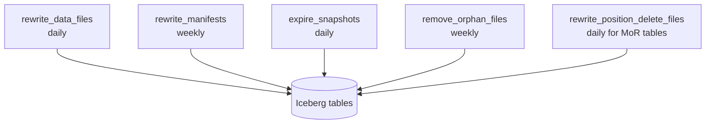

## The maintenance you will eventually need

Iceberg is not magic. Without regular maintenance, a healthy lake turns into:

- Query times creeping up 30% per month from small files
- S3 bills growing faster than data volume from orphaned files
- Snapshot histories bloating metadata
- `DELETE` files piling up until reads are slower than pre-Iceberg Hive

This post is the maintenance playbook we run. It's five jobs on a schedule, and it keeps ~180 tables healthy across a few PB.

## The five jobs



Each runs on EMR Serverless via Airflow DAGs. Scheduled, monitored, alerting on failure.

## 1. Compaction (`rewrite_data_files`)

Small files are the #1 cause of Iceberg performance degradation. Compaction merges them back toward target file size.

```sql
CALL glue_catalog.system.rewrite_data_files(
  table => 'analytics.orders',
  strategy => 'binpack',
  options => map(
    'target-file-size-bytes', '536870912',       -- 512 MB
    'min-input-files', '5',
    'partial-progress.enabled', 'true',
    'partial-progress.max-commits', '10',
    'max-concurrent-file-group-rewrites', '5'
  )
);
```

`partial-progress.enabled` is critical — without it, a single compaction commits at the end. On a 3 TB table that's a 40-minute transaction that can conflict with writers. Partial progress commits in batches.

For high-write tables we use `sort` strategy instead of `binpack`, clustering files by common filter columns:

```sql
CALL glue_catalog.system.rewrite_data_files(
  table => 'analytics.events',
  strategy => 'sort',
  sort_order => 'event_time ASC, user_id ASC'
);
```

Z-order works in recent Iceberg versions but we haven't moved to it in production yet; binpack and sort cover our needs.

## 2. Manifest rewrite (`rewrite_manifests`)

Manifests are Iceberg's "index of data files." As you add partitions, manifests fragment — a table with 10k partitions might have 200+ tiny manifest files. Queries have to list them all for planning.

```sql
CALL glue_catalog.system.rewrite_manifests('analytics.orders');
```

Runs weekly. Takes seconds to minutes. Single biggest impact on query planning time.

## 3. Snapshot expiry

Every write creates a snapshot. Snapshots reference data files. Old snapshots that no one will time-travel to are just keeping data files from being deleted.

```sql
CALL glue_catalog.system.expire_snapshots(
  table => 'analytics.orders',
  older_than => TIMESTAMP '2025-09-16 00:00:00',
  retain_last => 10
);
```

We keep 7 days of snapshots for most tables, 30 days for tables with audit requirements, and always keep the last 10 regardless of age.

## 4. Orphan file removal

Orphan files are S3 objects that exist in the table's directory but aren't referenced by any snapshot. Failed writes leave them behind. They don't affect correctness but they do affect your S3 bill.

```sql
CALL glue_catalog.system.remove_orphan_files(
  table => 'analytics.orders',
  older_than => TIMESTAMP '2025-09-20 00:00:00'
);
```

**Critical safety rule**: the `older_than` cutoff must be older than your longest-running write job. If a 2-hour Glue job is still uncommitted, its in-flight files look exactly like orphans. Delete them and the job fails. We use 48 hours.

## 5. Delete file compaction (for MoR tables)

Merge-on-read tables accumulate position delete files on every `DELETE`/`UPDATE`. Readers apply deletes at query time — slow.

```sql
CALL glue_catalog.system.rewrite_position_delete_files(
  table => 'analytics.orders_mor',
  options => map('rewrite-all', 'false')
);
```

Run after large delete batches. We trigger it from the GDPR deletion job itself.

## Scheduling & cost

The whole maintenance fleet runs on EMR Serverless. Per-month cost across 180 tables: ~$300. Without it, we estimated small-file overhead alone was costing ~$2,100/month in extra Athena scan time.

A rough schedule:

| Job | Frequency | Runtime (avg) |
|-----|-----------|---------------|
| rewrite_data_files (hot tables) | daily | 10–40 min each |
| rewrite_data_files (cold tables) | weekly | 30–90 min each |
| rewrite_manifests | weekly | seconds |
| expire_snapshots | daily | seconds |
| remove_orphan_files | weekly | 2–15 min |
| rewrite_position_delete_files | after delete batches | minutes |

Airflow DAG per job family, tagged with table SLA tier, so Tier 1 tables (BI-facing) get compacted aggressively and Tier 3 archive tables get lighter touch.

## Monitoring

Four metrics we track per table:

- **Average file size** (target: 128–512 MB)
- **Number of data files per partition** (target: 1–3)
- **Snapshot count** (alert > 500)
- **Manifest count** (alert > 50)

These come straight from Iceberg metadata tables:

```sql
SELECT file_count, total_size, AVG(file_size_in_bytes) as avg_size
FROM glue_catalog.analytics.orders.files;
```

## Key takeaways

1. Iceberg maintenance is not optional. Skipping it undoes everything Iceberg bought you.
2. Compaction with partial progress is the single most impactful job.
3. Orphan cleanup's `older_than` must exceed your longest write — this is a day-1 safety rule.
4. Track file count, snapshot count, and manifest count per table. These are your early warning signals.
