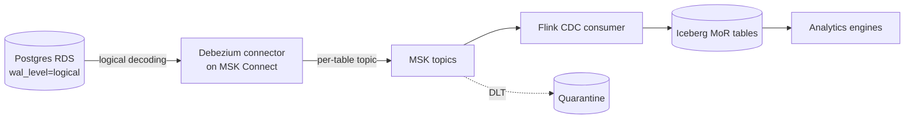

## Why CDC, not nightly dumps

We were pulling full snapshots of 60 Postgres tables every night. It worked for a year, then data volume tripled and the snapshot window started colliding with the morning traffic peak. Incremental CDC was the path out.

The stack we landed on: Postgres logical replication → Debezium on MSK Connect → MSK topics → Flink → Iceberg merge-on-read tables.

## Architecture



Per-table topic naming (`db.public.orders`) keeps consumers simple and lets us tune retention per table.

## The Postgres side

```sql
ALTER SYSTEM SET wal_level = 'logical';
ALTER SYSTEM SET max_replication_slots = 10;
ALTER SYSTEM SET max_wal_senders = 10;

CREATE PUBLICATION dbz_pub FOR TABLE public.orders, public.customers, ...;

SELECT pg_create_logical_replication_slot('dbz_slot', 'pgoutput');
```

On RDS, most of this is a parameter group change and a reboot. The parts that caused pain:

- **Replication slots retain WAL until consumed**. If Debezium is down and your slot isn't read, WAL grows until the disk fills. You learn this once.
- **DDL is not captured** by Debezium Postgres. Schema changes need to propagate separately — we run a DDL diff in CI and update the consumer schema before the producer.
- **TOASTed columns** (large values stored out-of-line) come through as placeholders unless `REPLICA IDENTITY FULL` is set. For columns you care about post-update, set it.

## Debezium connector config that actually works

```json
{
  "connector.class": "io.debezium.connector.postgresql.PostgresConnector",
  "database.hostname": "orders-db.cluster-xyz.rds.amazonaws.com",
  "database.dbname": "orders",
  "plugin.name": "pgoutput",
  "publication.name": "dbz_pub",
  "slot.name": "dbz_slot",
  "topic.prefix": "db",
  "snapshot.mode": "initial",
  "heartbeat.interval.ms": "10000",
  "heartbeat.action.query": "INSERT INTO dbz_heartbeat(ts) VALUES (now()) ON CONFLICT DO NOTHING",
  "tombstones.on.delete": "false",
  "decimal.handling.mode": "string",
  "time.precision.mode": "adaptive",
  "key.converter": "io.confluent.connect.avro.AvroConverter",
  "value.converter": "io.confluent.connect.avro.AvroConverter"
}
```

Two settings matter more than the rest:

- **`heartbeat.interval.ms`** with a heartbeat action: keeps the slot's confirmed LSN advancing on quiet tables. Without it, a table that never changes will hold WAL forever.
- **`decimal.handling.mode: string`**: Debezium's default is base64-encoded bytes. This breaks every downstream consumer. Always use `string`.

## The Flink consumer: Iceberg MoR

Flink reads the Debezium envelope (`before`, `after`, `op`), converts to Iceberg row-level operations, and writes to an MoR table.

```java
Table table = catalog.loadTable(TableIdentifier.of("db", "orders"));

FlinkSink.forRowData(cdcStream)
    .tableLoader(TableLoader.fromCatalog(catalog, TableIdentifier.of("db", "orders")))
    .equalityFieldColumns(List.of("id"))
    .upsert(true)
    .writeParallelism(8)
    .append();
```

Equality deletes (on `id`) + data files give us upsert semantics. A compaction job (covered in my [Iceberg maintenance post]()) rewrites delete files regularly so reads stay fast.

## Exactly-once is a spectrum

Debezium is at-least-once between Postgres and Kafka. Flink checkpoints give at-least-once between Kafka and Iceberg. Iceberg itself dedupes on equality key during compaction.

The result: end-to-end, our pipeline is *idempotent*, not exactly-once in the strict academic sense. Duplicate events can land briefly; they're resolved on compaction. For analytics this is fine. For financial ledger replication, you'd want additional dedupe downstream.

## The initial snapshot problem

On a 400 GB table, Debezium's initial snapshot takes hours and holds a long-running transaction on the source. Two mitigations:

- **Incremental snapshotting**: Debezium 2.x can signal-based snapshot in chunks without long transactions. Use it.
- **External seed**: take a point-in-time `pg_dump`, restore to the target, note the LSN, and start Debezium from that LSN. Much faster for huge tables.

```json
{
  "snapshot.mode": "never",
  "slot.name": "dbz_slot_seeded_from_lsn_0_12345678"
}
```

## What we monitor

- **Replication lag** (slot LSN vs current WAL LSN). Alert > 5 minutes.
- **MSK consumer lag** per Flink subtask.
- **Iceberg delete file count** per CDC table. Growth signals compaction isn't keeping up.
- **Heartbeat round-trip** — source → topic → consumer. One dashboard, everyone trusts it.

## Key takeaways

1. Logical replication slots are powerful and dangerous. Heartbeats, monitoring, and disk alarms are day-1 requirements.
2. Set `decimal.handling.mode = string`. Always. You will thank me.
3. Iceberg MoR + equality deletes + compaction is the cleanest landing pattern for CDC data.
4. Exactly-once is a design goal, not a product feature. Build for idempotency end-to-end.
