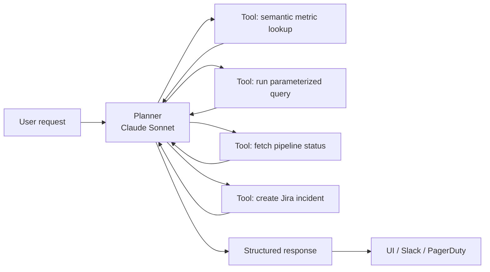

## Agents, not chatbots

Most "AI for data engineering" content is either a chatbot on top of docs or a text-to-SQL demo. The interesting use cases are neither. They're workflows where an agent plans a task, calls tools against your data platform, observes the result, and iterates.

This post is three agentic workflows we have in production, built on Bedrock Agents and the broader tool-use pattern. I'll also say clearly where agents are the wrong answer — that matters more than the wins.

## Pattern: agent + typed tools, not free-form SQL

The architecture we settled on after a lot of failed experiments:



Note: no "write arbitrary SQL" tool. Every database interaction is through a narrow, typed tool with a validated schema. This is the single most important decision in the design.

## Use case 1: pipeline triage agent

When a data pipeline fails, the first 15 minutes are usually spent collecting context: which upstream changed, whether source data landed, whether a DQ check fired, whether the same job failed recently. That's an agent-shaped problem.

Tools the agent has:

```python
@tool
def get_pipeline_run(run_id: str) -> PipelineRun:
    """Return status, logs tail, and duration for a pipeline run."""

@tool
def get_upstream_health(table: str, hours: int = 6) -> HealthReport:
    """Return landing status and row counts for upstream sources."""

@tool
def search_dq_failures(table: str, since: datetime) -> list[DQFailure]:
    """Return recent DQ expectation failures for a table."""

@tool
def prior_incidents(pipeline: str, days: int = 30) -> list[Incident]:
    """Return past incidents matching the same pipeline."""
```

The agent takes "Pipeline `orders_curated_daily` failed at 04:12, investigate" and returns a triage summary: root-cause hypothesis with evidence, links to logs, and a recommended next step. The on-call still decides the action — the agent removes the grunt work.

On 120 incidents over six months, the agent's top hypothesis matched the eventual RCA in ~70% of cases. Mean triage time dropped from 18 minutes to 4.

## Use case 2: metric question answering

The chatbot pattern, done right. Instead of text-to-SQL, we built a *semantic metric layer* and gave the agent only that.

Tool schema:

```json
{
  "name": "query_metric",
  "parameters": {
    "metric": {"enum": ["gmv", "active_users", "churn_rate", ...]},
    "grain": {"enum": ["day", "week", "month"]},
    "dimensions": {"type": "array", "items": {"enum": ["country", "segment", ...]}},
    "start": "date",
    "end": "date",
    "filters": {"type": "object"}
  }
}
```

The agent can only ask for things the metric layer already knows how to compute. Hallucinated columns are impossible because there are no columns — only named metrics.

Accuracy on a 200-question eval: 94%. Text-to-SQL on the same set: 72% and much more expensive debugging.

## Use case 3: schema change review

A repo listens for schema change PRs and runs an agent that:

1. Reads the diff
2. Queries downstream lineage (from our catalog)
3. Evaluates backward compatibility per consumer
4. Posts a PR comment with a risk score and suggested reviewers

This is mostly deterministic logic. The LLM's job is summarization and prioritization, not decision-making. That's the shape of agent work that's boring-and-reliable instead of flashy-and-flaky.

## Where agents are the wrong answer

- **Bulk data transformations**. If you can write the transformation as SQL or Spark, do that. Agents are 100–1000× more expensive per row.
- **Exactly-once workflows**. LLMs are non-deterministic. Wrap them in idempotent tools; don't rely on them for state.
- **Sub-second latency paths**. Agent loops routinely take 2–10 seconds. Fine for a human; unusable for a request/response API.
- **Questions with a known template**. If 90% of your "ad-hoc analytics" questions fit a handful of templates, a form beats an agent.

## Cost discipline

Each production agent has a budget:

- Max tool calls per session (we cap at 12)
- Max tokens per session (20k input, 2k output)
- Per-tenant daily spend alarm

Claude Sonnet for planning, Haiku for simple summarization inside tools, prompt caching on the tool schemas. Typical cost per triage run: ~$0.08.

## Observability

Agents are non-deterministic systems. You can't debug them without traces.

Every run logs:

- The full conversation (system, user, assistant, tool calls, tool results)
- Tool latency per call
- Total tokens, cost
- Outcome label (applied retroactively by a human reviewer or by outcome signals)

This dataset feeds weekly quality review. It's also training data if we ever want to fine-tune a smaller model on our tool-use patterns.

## Key takeaways

1. The winning pattern is agent + narrow typed tools, not agent + raw SQL.
2. Agents shine at context-gathering, triage, and summarization. They're bad at bulk transformation.
3. Budget every agent. Token limits, tool-call caps, cost alarms — day-one requirements.
4. Log every run in full. Non-determinism without observability is just hope.
